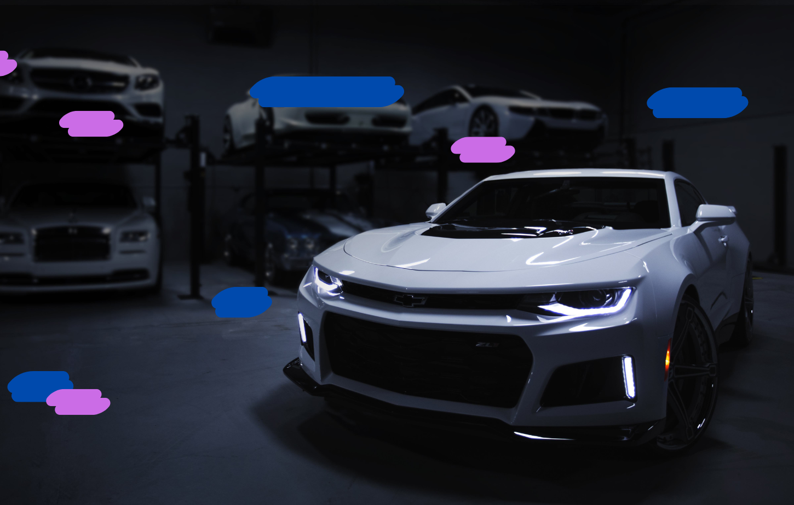

# TeranCar - Plateforme de Vente et Location de Véhicules

  
</div>

TeranCar est une plateforme web moderne permettant la location et la vente de véhicules à Dakar, Sénégal. Le site offre une expérience utilisateur intuitive avec des fonctionnalités avancées de recherche, de réservation et de gestion de compte.

🌐 **Site en production** : [https://terancar-production.up.railway.app/](https://terancar-production.up.railway.app/)

<div align="center">
  <p>
    <a href="https://terancar-production.up.railway.app/">
      
    </a>
    <a href="LICENSE">
      
    </a>
  </p>
</div>

## 🚀 Fonctionnalités

### 👤 Gestion des utilisateurs
- Inscription et connexion sécurisées
- Profils utilisateurs personnalisés
- Système de rôles (client, admin, vendeur, support)
- Gestion des favoris

### 🚘 Gestion des véhicules
- Catalogue complet de véhicules
- Filtrage par marque, modèle, prix
- Système de recherche avancé
- Détails détaillés des véhicules
- Gestion des images et spécifications

### 🛒 Système de panier
- Panier persistant en base de données
- Gestion des quantités
- Calcul automatique des prix
- Support pour location et achat

### 📅 Système de réservation
- Calendrier de disponibilité
- Gestion des dates de location
- Confirmation par email
- Suivi des réservations

### 💬 Support client
- Système de tickets
- Messagerie interne
- FAQ interactive
- Témoignages clients

## 📋 Prérequis

- PHP 8.0 ou supérieur
- MySQL 5.7 ou supérieur
- Apache 2.4 ou supérieur
- XAMPP (recommandé pour le développement local)
- Extensions PHP requises :
  - PDO
  - PDO_MySQL
  - GD
  - mbstring
  - json

## ⚙️ Installation

### Développement local

1. Clonez le dépôt dans votre dossier htdocs de XAMPP :
```bash
git clone https://github.com/votre-username/DaCar.git
cd DaCar
```

2. Configurez votre base de données MySQL en important le fichier `terancar.sql`.

3. Configurez les paramètres de connexion à la base de données dans `config/config.php`.

4. Assurez-vous que les services Apache et MySQL sont démarrés dans XAMPP.

### Déploiement Railway

Le projet est déployé automatiquement sur Railway à partir de la branche principale. La configuration inclut :
- Base de données MySQL hébergée sur Railway
- Variables d'environnement pour les connexions sécurisées
- HTTPS automatique
- Déploiement continu

## 🌐 Accès à l'application

- **Production** : [https://terancar-production.up.railway.app/](https://terancar-production.up.railway.app/)
- **Local** : `http://localhost/DaCar`
- **PhpMyAdmin (local)** : `http://localhost/phpmyadmin`

## 🛠️ Structure du projet

```
DaCar/
├── config/
│   ├── config.php         # Configuration générale
│   └── database.php       # Configuration de la base de données
├── includes/
│   ├── init.php          # Initialisation de l'application
│   ├── functions.php     # Fonctions utilitaires
│   ├── template.php      # Template principal
│   └── header.php        # En-tête commun
├── public/
│   ├── assets/          # Ressources statiques
│   │   ├── css/
│   │   ├── js/
│   │   └── images/
│   ├── pages/           # Pages du site
│   │   ├── auth/        # Pages d'authentification
│   │   ├── catalogue/   # Pages du catalogue
│   │   ├── panier/      # Pages du panier
│   │   └── vehicule/    # Pages des véhicules
│   └── index.php        # Point d'entrée principal
└── .htaccess           # Configuration Apache
```

## 🔧 Configuration

### Base de données
- **Local** :
  - Nom de la base : `dacar`
  - Utilisateur : `root`
  - Mot de passe : `` (vide)
- **Production** :
  - Configuration via variables d'environnement Railway
  - Connexion sécurisée SSL/TLS

### Apache
Le fichier `.htaccess` est configuré pour :
- Gérer les redirections
- Protéger les fichiers sensibles
- Activer la réécriture d'URL
- Gérer les erreurs 404 et 403
- Forcer HTTPS en production

## 🔐 Sécurité

- Protection contre les injections SQL
- Validation des entrées utilisateur
- Protection des fichiers sensibles
- Gestion sécurisée des sessions
- HTTPS forcé en production
- Variables d'environnement sécurisées
- Protection CSRF
- Headers de sécurité configurés

## 📱 Responsive Design

L'application est entièrement responsive et s'adapte à tous les appareils :
- Desktop (>1200px)
- Tablette (768px - 1199px)
- Mobile (<767px)

## 🎨 Interface utilisateur

- Design moderne et épuré
- Navigation intuitive
- Animations fluides
- Thème personnalisable
- Support multilingue (FR/EN)

## 🔄 Système de routage

Le site utilise un système de routage personnalisé :
- URLs propres et SEO-friendly
- Gestion des paramètres d'URL
- Redirection automatique
- Gestion des erreurs 404

## 📊 Base de données

Structure principale des tables :
- `utilisateurs` : Gestion des utilisateurs
- `vehicules` : Catalogue des véhicules
- `panier` : Gestion du panier
- `commandes` : Suivi des commandes
- `locations` : Gestion des locations
- `messages` : Support client

## 📞 Informations de contact

- **Téléphone** : +221 78 123 45 67 / +221 33 823 45 67
- **Email** : contact@terancars.sn
- **Adresse** : 97 Route de la Corniche Dakar, Sénégal

## 📝 License

Ce projet est sous licence MIT. Voir le fichier `LICENSE` pour plus de détails.

## 🤝 Contribution

Les contributions sont les bienvenues ! N'hésitez pas à :
1. Fork le projet
2. Créer une branche pour votre fonctionnalité
3. Commiter vos changements
4. Pousser vers la branche
5. Ouvrir une Pull Request

## 🙏 Remerciements

- Tous les contributeurs
- La communauté open source
- Les utilisateurs qui nous font confiance
